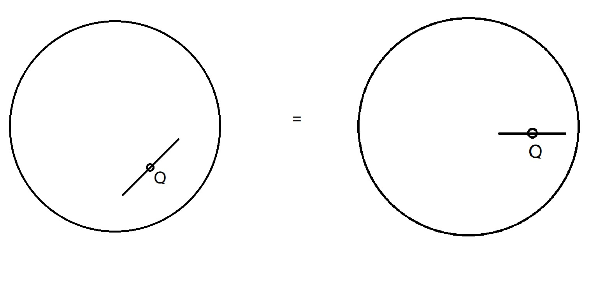
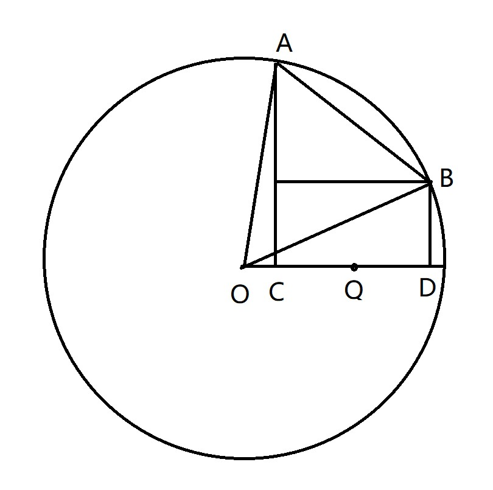

[题目链接](https://ac.nowcoder.com/acm/contest/33186/D)

[多校信息汇总贴](https://ac.nowcoder.com/discuss/944978)

题目大意：

给定一个圆心位于 $(0,0)$ ，半径为 $r$ 的圆，给定圆内一点 $Q$ 为中点，画出一条长度为 $2d$ 的线段，线段可以旋转，但是必须严格位于圆内.

从线段可以选择一侧发出电磁炮（“一侧”是指与线段垂直的方向），位于该方向的、在圆上的、投影位于线段上的点（也就是该线段所对的一段弧）可以被摧毁，问最长可以被摧毁的弧长是多少？

题解：

首先进行坐标变换：



如图，由于圆的对称性，将点 $Q(x,y)$ 转移到 $(\sqrt{x^2 + y^2},0)$ 是等价的.




对 $Q$ 经过坐标变换后， $C$ 和 $D$ 的坐标是已知的，那么 $OC$ 和 $OD$ 长度已知，就可以算出 $\angle AOD$ 和 $\angle BOD$ ，进而可以得到 $\angle AOB$ ，并且是弧度制.

角度制下弧长公式为： $L = \frac{\alpha \pi r}{180}$ ， $\alpha$是角度.

角度值转弧度制公式为： $A = \frac{\alpha \pi}{180}$ .

因此，由于我们得到的角度是弧度制，直接用其乘以半径即可得到弧长.


代码：

```cpp
#include<bits/stdc++.h>
#define ll long long
#define pll pair<ll,ll>
#define ld long double
#define debug(x) cout << #x << " = " << (x) << endl
using namespace std;
ld r,x,y,d;
const ld PI = 3.1415926535;
/*
1
2
0 -1 1
*/
void solve()
{
	cin >> r >> x >> y >> d;
	
	ld P = sqrt(x * x + y * y);
	ld L = P - d;
	ld R = P + d;
	cout << fixed << setprecision(12) << (acos(L / r) - acos(R / r)) * r << endl;
}
int main()
{
	ll _;
	cin >> _;
	while(_ -- )
	{
		solve();
	}
}
```

