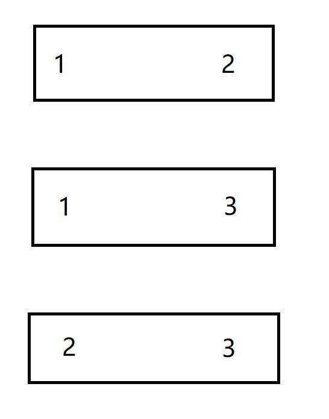
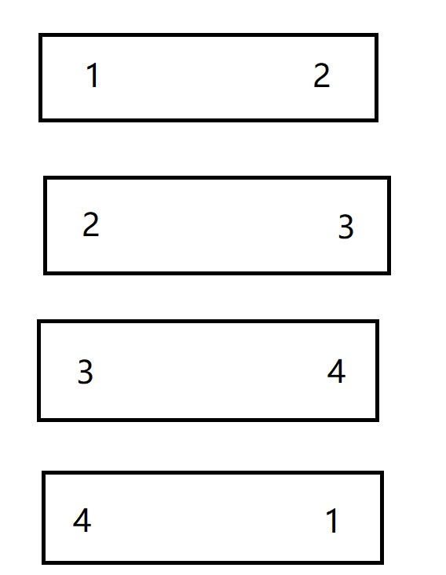
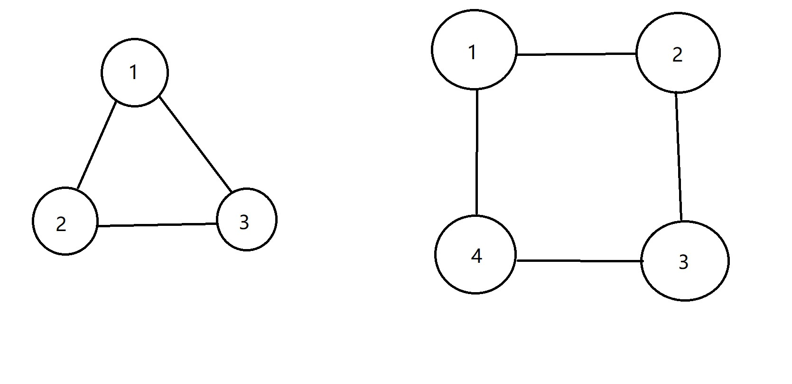

[题目链接](https://codeforces.com/problemset/problem/1702/E)

题目大意：

有一堆骨牌，每个上面有两个数字，问能否将所有骨牌划分到两个集合里，令每个集合的骨牌数字分别是不重复的.

题解：

首先，如果一个数字出现了三次及以上，一定无解.

对于其他情况，来看这样两个例子：

第一个：



第二个：



第一个例子无解，但是第二个例子有解，为什么会这样呢？

如果我们令数字为点，然后为同一块骨牌上的数字连一条边的话，会发现：


形成奇环的，没有解；而形成偶环的，有解.

原因在于，每一条边（即每块骨牌），都只能与在图上不与其相邻的边划分到一个集合里，对于偶环，总能找到一种划分方式，但是对于奇环，最终总会有一条边无法划分到任何集合里.

故建图后对每个连通分量，判一下二分图即可，不是二分图一定有奇环.

代码：

```cpp
#include<bits/stdc++.h>
#define ll long long
#define pll pair<ll,ll>
using namespace std;
const ll N = 2e5 + 5;
ll n;
vector<pll>arr;
set<ll>g[N];
int vis[N];
ll deg[N];
int dfs(ll fa, ll st)
{
	for(auto i : g[st])
	{
		if(vis[i] == 0)
		{
			vis[i] = (vis[st] == 1) ? 2 : 1;
			if(dfs(st, i))
			{
				return 1;
			}
		}
		else
		{
			if(vis[i] == vis[st])
			{
				return 1;
			}
		}
	}
	return 0;
}
void solve()
{
	cin >> n;
	arr.clear();
	for(ll i = 1; i <= n; i ++ )
	{
		ll a, b;
		cin >> a >> b;
		arr.push_back({a, b});
		g[i].clear();
		vis[i] = 0;
		deg[i] = 0;
	}
	
	for(auto i : arr)
	{
		ll x = i.first;
		ll y = i.second;
		
		g[x].insert(y);
		g[y].insert(x);
		//g[x].push_back(y);
		//g[y].push_back(x);
		
		deg[x] ++ ;
		deg[y] ++ ;
		
	}
	

	int f = 0;
	
	for(ll i = 1; i <= n; i ++ )
	{
		if(deg[i] > 2)
		{
			f = 1;
			break;
		}
	}
	
	if(f)
	{
		cout << "NO" << endl;
		return;
	}
	
	for(ll i = 1; i <= n; i ++ )
	{
		if(!vis[i])
		{
			//cout << "start from " << i << endl;
			vis[i] = 1;
			if(dfs(0, i))
			{
				f = 1;
				break;
			}
		}
	}
	
	if(f)
	{
		cout << "NO" << endl;
		return;
	}
	
	cout << "YES" << endl;
	
}
int main()
{
	ll _;
	cin >> _;
	while(_ -- )
	{
		solve();
	}
}
```


