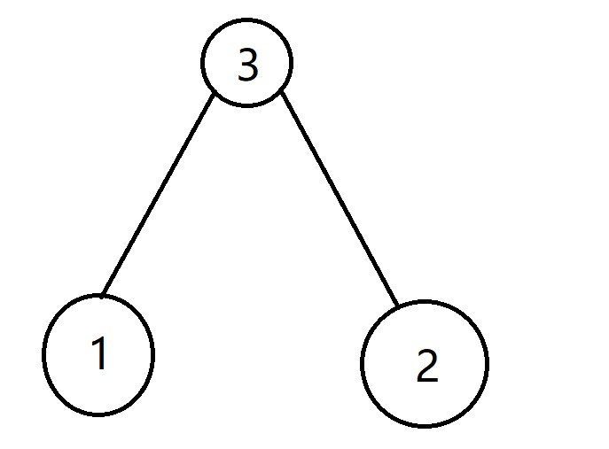
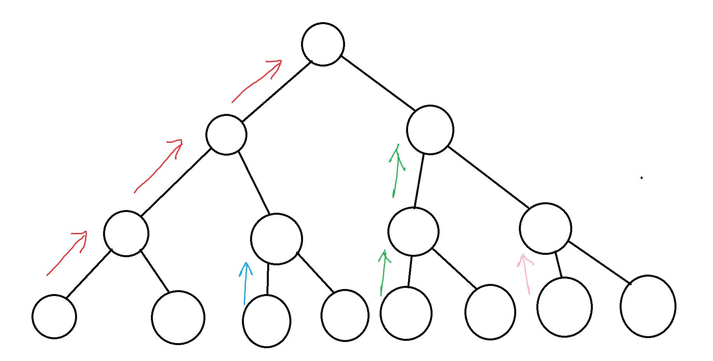
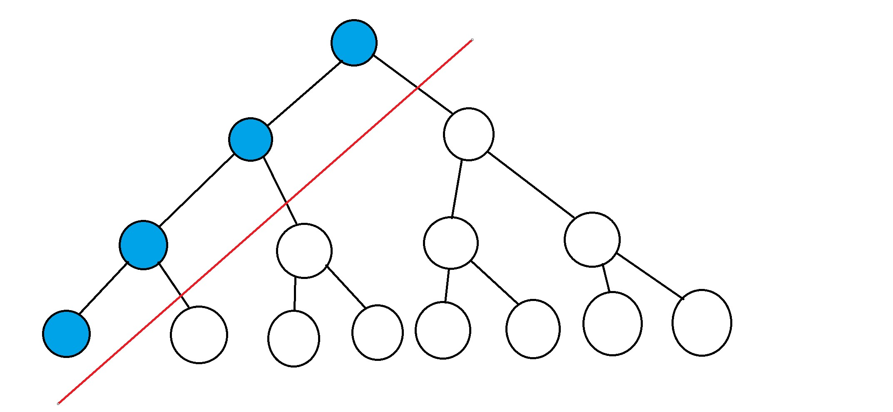
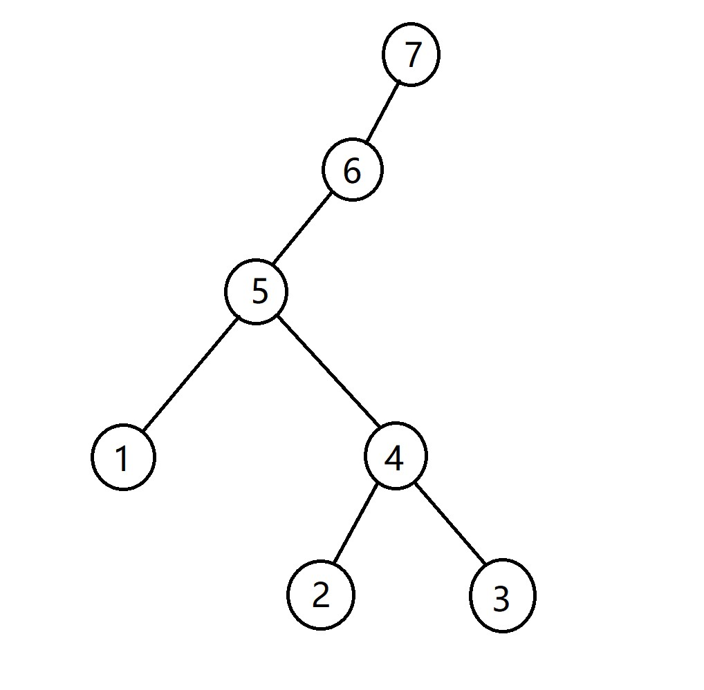

[题目链接](https://codeforces.com/contest/1740/problem/E)

题目描述：

给出一棵包含 $n$ 个节点的树，树的节点本身没有权值，但是可以选择一个长度为 $n$ 的排列为节点赋值；

每次操作选择一个叶子节点，将其权值放到数列 $s$ （初始为空）的末尾，如果叶子的父节点权值大于该叶子节点权值，交换二者的权值，然后删除叶子节点；否则直接删除叶子节点。

问，所能得到的数列 $s$ 的最长非降子序列（下面简称 $LNS$ ）长度是多少？

题解：

很高兴独立解决了这个问题，我认为这个问题比较难。

首先我们考虑如何分配权值。



首先考虑上图这样的基本情况（其他情况比如单叉多叉也是类似的），我们考虑为其分配排列 $[1,2,3]$ ，显然，将较小的值放在子节点，可以令 $LNS$ 的长度最长。

之后，我们总假设将极小值放在左节点，即，对于任意一棵树，其最小值在这棵树最左边的叶子节点；由于我们之后可以调整树的结构，所以这里暂时先这样假设。

在这样的假设下，如果我们尝试执行题目的操作，会发现树的最左子节点会一路向上“传递”。

比如对于下面这张图，不同颜色的箭头就指示了不同权值传递的轨迹；注意由于我们将极小值放在左边，所有对于每颗子树，右孩子的权值要大于左孩子，所以右孩子的传播路径长度要短于左孩子。




进一步分析，对于一颗根为 $r$ 的树，其 $LNS$ 长度有两种情况：

1. 左子树的 $LNS$ 加上右子树的 $LNS$ ；

2. 只取最左长链，如下图所示：



在这种情况下，所有右子树都被舍弃掉了。

这道题是分析大量小规模的例子做出来的，分析一些规模较小的例子，是入手解决问题的好方法。

下图是让我了解到第二种选取左长链方式正确性的例子：




图中，我们走到节点 $5$ 的时候，选择方式 $1$ 显然更优，即合成左右子树的答案，但是等到了节点 $7$ ，显然选择左长链 $[1,5,6,7]$ 更优，这时，我们放弃了子树 $4$ ，即使我们继续向高走（假设上面还有节点），选择子树 $4$ 也不会再比选择左长链更优。

最后一个要注意的点，我们之前都是假设将极小值放在左节点，但是实际我们要考虑树的结构；显然，如果令长度最长的链作为左长链，可以使答案最优。

代码：

```cpp
#include<bits/stdc++.h>
#define debug(x) cout << #x << " = " << (x) << endl
#define ll long long
using namespace std;
const ll N = 1e5 + 5;
ll n;
vector<ll>g[N];
ll L_dis[N];
void dfs1(ll cur)
{
	if(g[cur].size() == 0)
	{
		L_dis[cur] = 1;
		return;
	}
	ll mm = 0;
	for(auto i : g[cur])
	{
		dfs1(i);
		mm = max(mm, L_dis[i] + 1);
	}
	L_dis[cur] = mm;
}
ll dfs(ll cur)
{
	if(g[cur].size() == 0)
	{
		return 1;
	}
	/*else if(g[cur].size() == 1)
	{
		return dfs(g[cur][0]) + 1; 
	}*/
	else
	{
		ll res = 0;
		for(auto i : g[cur])
		{
			res += dfs(i);
		}
		return max(res, L_dis[cur]);
	}
}
int main()
{
	cin >> n;

	for(ll i = 2; i <= n; i ++ )
	{
		ll x;
		cin >> x;
		g[x].push_back(i);
	}
	dfs1(1);
	cout << dfs(1) << endl;
	
}
```


